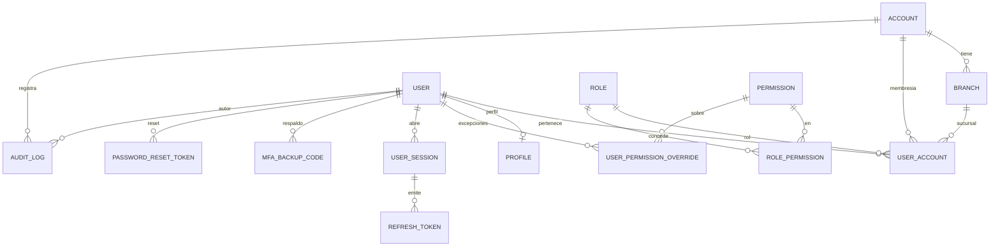
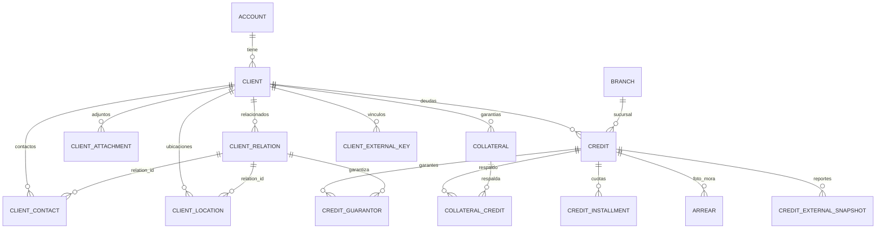
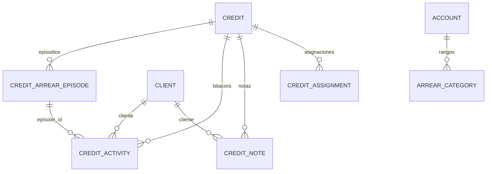
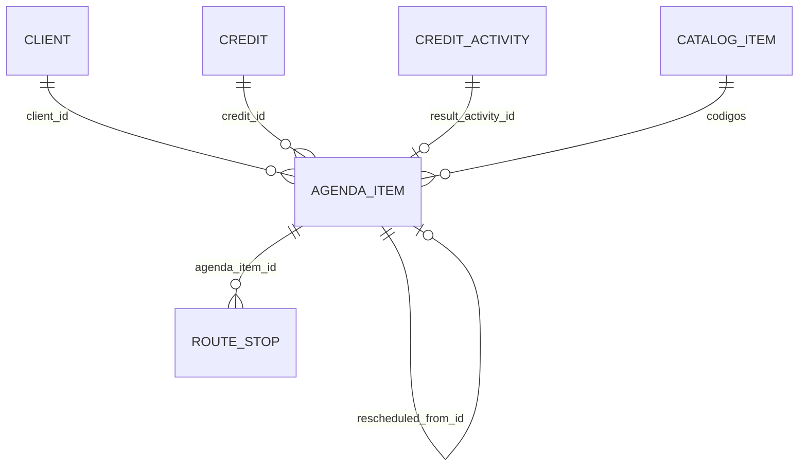
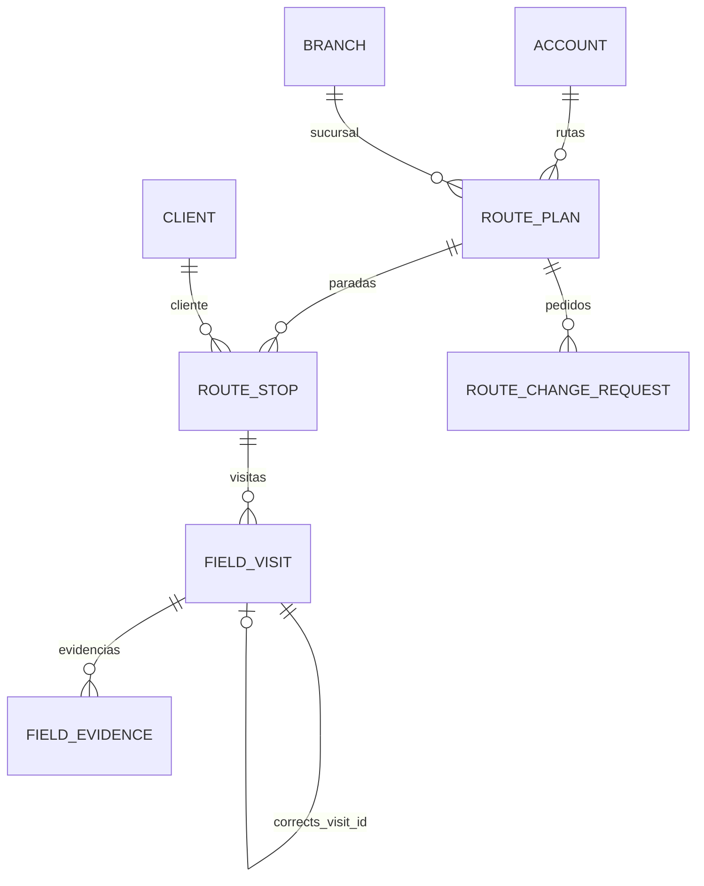
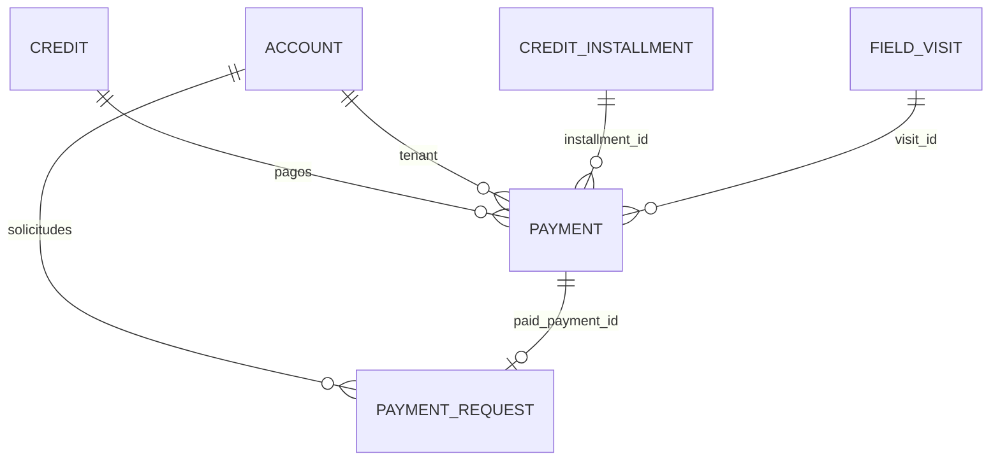
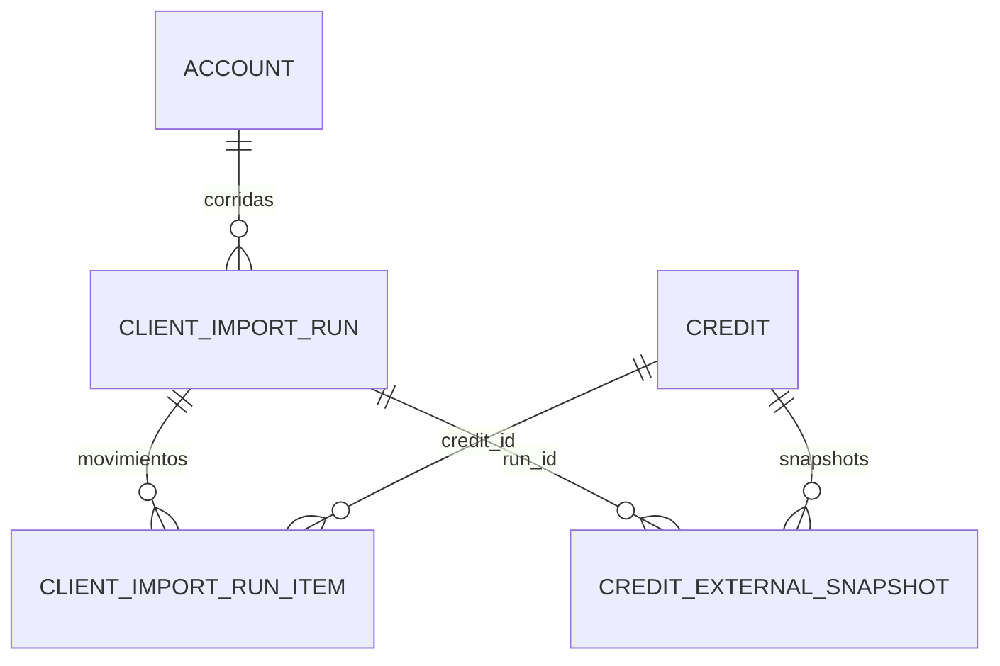
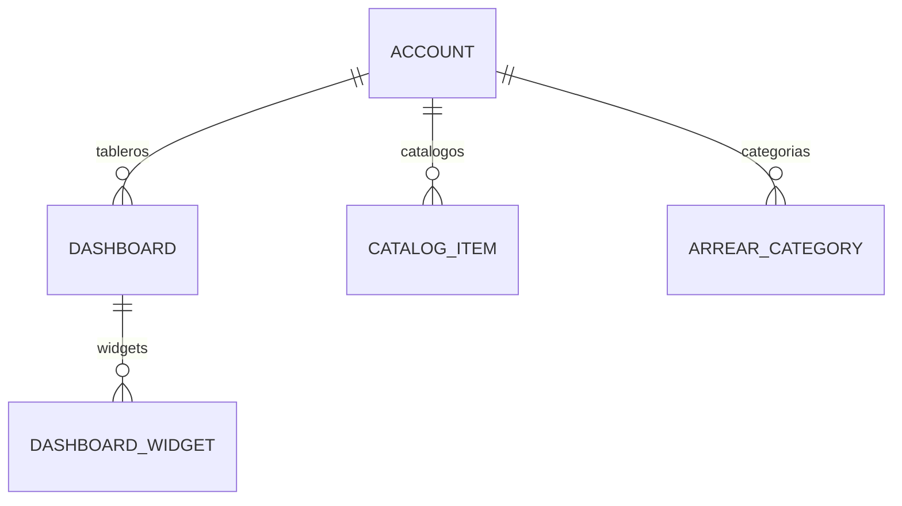

# Modelo de datos de Kobrax

Fuente: `packages/database/prisma/schema.prisma` (48 modelos, 39 enums), migraciones en `packages/database/prisma/migrations/` y scripts RLS en `packages/database/prisma/rls/`. Verificado sobre el árbol de trabajo del 2026-10-09 (la rama tiene cambios sin commitear en `schema.prisma` y `rls/001_enable_rls.sql`; lo descrito es lo que hay en el árbol).

## 0. Convenciones generales

- Modelos `PascalCase` singular; columnas `snake_case` por `@map`; tablas plural por `@@map`; ids `String @default(uuid())` (columnas `text`, no `uuid` nativo: por eso `app_current_account()` devuelve `text`, `rls/001_enable_rls.sql`).
- Multi-tenant: toda tabla operativa lleva `account_id`. Tablas **globales** sin `account_id`: `users`, `profiles`, `roles`, `permissions`, `role_permissions`, `mfa_backup_codes`, `password_reset_tokens`.
- Soft delete (`deleted_at`) en maestros: `accounts`, `branches`, `users`, `clients`, `credits`, `agenda_items`, `catalog_items`, `dashboards`, `credit_notes`, `client_external_keys`, `external_advisor_links`.
- **Inmutables / append-only** (sin `updated_at` ni `deleted_at`, por diseño): `payments`, `audit_logs`, `field_visits`, `field_evidences`, `credit_external_snapshots`, `credit_activities`. Ojo: la inmutabilidad es **de aplicación**; `001_enable_rls.sql` concede `UPDATE`/`DELETE` a `kobrax_app` sobre estas tablas (no hay trigger ni REVOKE que lo impida).
- Referencias suaves (sin FK) a `users.id`: `collector_id`, `assignee_id`, `user_id` en varias tablas, `created_by`, etc.
- **No existe el «caso» de cobranza.** Verificado: la migración `20261005000000_eliminar_caso` (F4/08 fase 6, irreversible) hace `DROP TABLE collection_cases` y `case_activities`, elimina los enums `CaseStatus`, `CasePriority`, `CaseActivityType`, las columnas `case_id` de `payments`, `payment_requests`, `field_visits`, `route_stops`, `notifications`, `agenda_items`, `credit_assignments`, los valores `CASE_*` de `NotificationType` y `WRITTEN_OFF` de `CreditStatus`. En `schema.prisma` no queda ningún modelo ni referencia a `collection_case`. Restos que sólo son historia o están desactualizados: migraciones antiguas (`20260616022844_init_pillars_1_to_4`, `20260618180000_add_case_open_unique`, etc.), `packages/database/verify/*.sql`, `packages/database/CLAUDE.md` (aún muestra plantillas con `collection_cases`) y un spec de analytics (`apps/api/src/modules/analytics/analytics.service.spec.ts`).
- `route_plans.total_cases` se queda: es un contador de paradas (comentario de la migración de eliminación).

## 1. Seguridad de datos transversal

### 1.1 RLS (Row Level Security)

- `rls/001_enable_rls.sql`: recorre una lista de tablas operativas y por cada una hace `ENABLE` + `FORCE ROW LEVEL SECURITY`, crea la policy `tenant_isolation` (`USING`/`WITH CHECK account_id = app_current_account()`) y da `GRANT SELECT,INSERT,UPDATE,DELETE` a `kobrax_app`. La API conecta como `kobrax_app` (sin BYPASSRLS) y fija `app.current_account_id` con `SET LOCAL` por transacción (`apps/api/src/database/prisma.service.ts`).
- **Con RLS `tenant_isolation`**: `branches`, `user_accounts`, `user_sessions`, `audit_logs`, `clients`, `client_contacts`, `client_locations`, `client_relations`, `client_attachments`, `credits`, `credit_installments`, `arrears`, `client_import_runs`, `route_plans`, `route_stops`, `field_visits`, `field_evidences`, `payments`, `payment_requests`, `notifications`, `refresh_tokens`, `agenda_items`, `catalog_items`, `dashboards`, `dashboard_widgets`, `collaterals`, `collateral_credits`, `credit_guarantors`, `credit_assignments`, `credit_arrear_episodes`, `credit_notes`, `credit_activities`, `arrear_categories`, `credit_external_snapshots`, `client_external_keys`, `external_advisor_links`, `client_import_run_items`, `route_change_requests`, `device_push_tokens`.
- `accounts`: policy `tenant_self` (`id = app_current_account()`); `kobrax_app` sólo tiene SELECT/INSERT/UPDATE.
- `user_permission_overrides`: policy `account_id IS NULL OR account_id = app_current_account()` (overrides globales posibles).
- **Sin RLS (globales, acceso controlado por la app):** `users`, `profiles`, `roles`, `permissions`, `role_permissions`, `mfa_backup_codes`, `password_reset_tokens`.
- Funciones `SECURITY DEFINER` que saltan RLS de forma acotada: `auth_memberships(user_id)` (`002_auth_functions.sql`), `auth_user_sessions(user_id)` (`003_session_functions.sql`), `promise_due_account_ids()` (`004_notification_functions.sql`, sólo ids de cuentas vivas), y las de los triggers `portfolio_totals_recalc` / `credits_track_arrear_episode`.
- **Alcance dentro de la empresa (`account` / `own` / `system`)**: `rls/002_scope.sql` define sólo helpers (`app_current_user()`, `app_current_scope()`, `app_scope_sees_all()`); el propio archivo dice que «las policies llegan en F2». En el repositorio **no hay ninguna policy SQL que use `app_current_scope()`** (grep sobre `rls/` y `migrations/`). `PrismaService` sí setea `app.scope`; el filtrado por asignación efectiva lo hace entonces la capa de aplicación (ver doc de backend). `rls/verify_isolation.sql` es un script de verificación.

### 1.2 Cifrado de PII

AES-256-GCM, formato `iv.tag.ct` en base64 (`apps/api/src/common/crypto/crypto.service.ts`, `packages/database/prisma/pii.ts`); blind index HMAC-SHA256 sobre el valor normalizado (mayúsculas, sin espacios/puntos/guiones/barras) en `blind-index.service.ts`. Claves: `APP_ENCRYPTION_KEY` y `APP_BLIND_INDEX_KEY` (32 bytes hex).

| Dato | Tabla.columna | Tratamiento |
|---|---|---|
| Documento de identidad | `clients.national_id` | cifrado + `clients.national_id_hash` (blind index, único por tenant) |
| NIT / tax id | `clients.tax_id` | cifrado |
| Valor de contacto (teléfono/email/WhatsApp) | `client_contacts.value` | cifrado al crear/editar (`clients.service.ts`, ~líneas 185, 753, 799) |
| Secreto TOTP | `users.mfa_secret` | cifrado (`mfa.service.ts`) |
| Refresh / reset / códigos de respaldo MFA | `refresh_tokens.token_hash`, `password_reset_tokens.token_hash`, `mfa_backup_codes.code_hash` | sólo hash SHA-256 |
| Contraseña | `users.password_hash` | hash (algoritmo: ver `password.service.ts`, no verificado aquí) |
| Direcciones y coordenadas | `client_locations.address`, `latitude`, `longitude` | **en claro** (sin cifrado en el código revisado) |

### 1.3 Evidencia inmutable

`field_evidences.file_hash` (SHA-256 del buffer original), `payments.receipt_hash`, `client_attachments.file_hash`. Sin `updated_at`/`deleted_at`: la corrección de una visita es una visita nueva con `corrects_visit_id`.

### 1.4 Lógica en la base (triggers y funciones)

- `credits_totals_ins/upd/del` → `credits_touch_client_totals()` → `portfolio_totals_recalc()`: mantienen `clients.total_debt`, `max_days_past_due`, `credit_count`, `total_debt_external`, `max_days_past_due_external`. **No deben escribirse desde la app** (`20260814210000_denormalize_portfolio_totals`, redefinida en `20260930000000_creditos_de_fuente_externa`). El trigger de UPDATE sólo se dispara si cambian `outstanding_balance`, `days_past_due`, `client_id` o `deleted_at`.
- `credits_arrear_episode_ins/upd` → `credits_track_arrear_episode()` (versión vigente en `20261005000000_eliminar_caso`): abre/cierra `credit_arrear_episodes` (ver §4).
- Funciones puras `arrear_episode_source_of` y `arrear_episode_declared_start` (`20261003020000_episodios_de_mora`).

## 2. Dominio acceso / tenant

| Modelo (tabla) | Propósito y campos clave | RLS |
|---|---|---|
| `Account` (`accounts`) | Tenant raíz. `account_type`, `account_status` (default `TRIAL`), `plan_code` (default `FREE`), `limits_override` JSON (topes propios que pisan al plan), `country_code`, `currency_code`, `timezone`, `settings`/`configuration` JSON. `code` único. | `tenant_self` |
| `Branch` (`branches`) | Sucursal/agencia. `manager_user_id` (ref suave), `active`. Índices `(account_id)`, `(account_id, active)`. | sí |
| `User` (`users`) | Identidad global (puede estar en varios tenants). `email` único, `failed_login_attempts`, `locked_until`, `requires_password_change`, `mfa_enabled`, `mfa_secret` (cifrado), `user_status`, última posición conocida. | no (global) |
| `Profile` (`profiles`) | Datos personales 1:1 con `User` (`user_id` único): nombre, teléfono, documento, `payment_qr_url` (QR bancario propio del cobrador; no es pasarela), `supervisor_user_id`, `employee_code`. | no (global) |
| `Role` (`roles`) | Cargo. `name` único, `level`, `is_system`. Nombres que aparecen en migraciones: SUPER_ADMIN, ACCOUNT_ADMIN, MANAGER, SUPERVISOR, COLLECTOR, AUDITOR, VIEWER. | no |
| `Permission` (`permissions`) | `code` único `{recurso}:{acción}`, `module`, `action`, `scope`. Códigos de alcance de datos: `data:scope:all`, `data:scope:branch` (`20261004010000_alcance_supervisor_agencia`). | no |
| `RolePermission` | PK compuesta `(role_id, permission_id)`. | no |
| `UserPermissionOverride` | Concesión/negación individual (`granted`), `expires_at`, `account_id` opcional. | policy especial |
| `UserAccount` (`user_accounts`) | Usuario ↔ empresa ↔ rol ↔ sucursal. `@@unique([user_id, account_id])`, `is_owner`, `is_default`, `is_active`. | sí |
| `UserSession` (`user_sessions`) | Sesión: ip, dispositivo, `device_type` (web/mobile/api), `expires_at`, `revoked_at`, `is_active`. | sí |
| `RefreshToken` (`refresh_tokens`) | Rotatorio; sólo `token_hash`, `family_id`, `session_id`, `replaced_by`, `revoked_at`. | sí |
| `MfaBackupCode` | Un solo uso (`used_at`), `code_hash`. | no |
| `PasswordResetToken` | Un solo uso, expira (30 min según el comentario del schema). | no |
| `AuditLog` (`audit_logs`) | Append-only: `action`, `entity`, `entity_id`, `before`/`after` JSON, `ip`, `user_agent`. Índices `(account_id, entity, entity_id)`, `(account_id, user_id)`. | sí |

Enums: `AccountType` {FINANCIAL_INSTITUTION, COLLECTION_AGENCY, RETAIL_CREDIT, INDEPENDENT}; `AccountStatus` {ACTIVE, TRIAL, SUSPENDED, INACTIVE, CANCELLED}; `PlanCode` {FREE, PROFESSIONAL, BUSINESS, ENTERPRISE}; `UserStatus` {ACTIVE, INACTIVE, SUSPENDED, LOCKED, PENDING}; `PermissionAction` {CREATE, READ, UPDATE, DELETE, EXECUTE, APPROVE}; `PermissionScope` {GLOBAL, ACCOUNT, BRANCH, OWN}.

## 3. Dominio cartera (clientes y créditos)

| Modelo (tabla) | Propósito y campos clave | Índices / restricciones |
|---|---|---|
| `Client` (`clients`) | Deudor (persona o empresa). `client_type`, `client_status`, `national_id` (cifrado) + `national_id_hash`, `tax_id` (cifrado), `risk_segment`, `metadata`. Agregados mantenidos por trigger: `total_debt`, `max_days_past_due`, `credit_count`, `total_debt_external`, `max_days_past_due_external`. `link_review_pending` (creado por import con coincidencias sin confirmar). | `@@unique([account_id, national_id_hash])`; `(account_id, max_days_past_due desc, total_debt desc, id)` y `(account_id, total_debt desc, id)` (órdenes de la cartera); `(account_id, link_review_pending)`; parcial `WHERE deleted_at IS NULL` (`20260616030000`) |
| `ClientContact` | Teléfono/email/WhatsApp. `relation_id` null = del cliente; set = de una persona relacionada. `value` cifrado, `is_primary`, `is_verified`. | `(account_id, client_id)`, `(account_id, relation_id)` |
| `ClientLocation` | Punto físico, `latitude`/`longitude` Decimal(10,8)/(11,8), `photo_urls` JSON, `visit_schedule`, `risk_level`. Igual patrón `relation_id`. | idem |
| `ClientRelation` | Persona relacionada (garante, familiar…), `is_contactable`. | `(account_id, client_id)` |
| `CreditGuarantor` | N:N garante ↔ crédito. PK `(relation_id, credit_id)`, `onDelete: Cascade`. | `(account_id, credit_id)` |
| `Collateral` | Garantía no personal (bien). Cuelga del cliente. `type` = código del catálogo `COLLATERAL_TYPE`, `estimated_value`, `currency`, `photo_urls`. | `(account_id, client_id)` |
| `CollateralCredit` | N:N garantía ↔ crédito. PK `(collateral_id, credit_id)`. | `(account_id, credit_id)` |
| `ClientAttachment` | Evidencia documental, `file_hash`, `encrypted`. | `(account_id, client_id)` |
| `Credit` (`credits`) | Obligación. `principal_amount`, `outstanding_balance`, `interest_rate`, `currency`, `installments_count`, `status`, `days_past_due`, `assigned_manager_id` (responsable, ref suave), `type_code` (catálogo `CREDIT_TYPE`), `metadata` (cuota, frecuencia, próxima fecha…), `origin`; fuente externa: `external_source`, `external_id`, `sync_status`, `absent_since`, `last_seen_run_id`, `reported_as_of`; castigo: `written_off_at/by/reason`; `last_action_at` (informativo). | `code` **ya no es único** (es rótulo); único parcial `credits_external_identity_key (account_id, external_source, external_id) WHERE external_id IS NOT NULL` (incluye borrados); `(account_id, external_source, sync_status)`, `(account_id, status)`, `(account_id, client_id)` |
| `CreditInstallment` | Cronograma: `number`, `due_date`, `amount`, `principal`, `interest`, `paid_amount`, `status`, `paid_at`. | `@@unique([credit_id, number])`; `(account_id, status)` |
| `Arrear` (`arrears`) | Foto de mora calculada (`days_overdue`, `overdue_amount`, `interest`, `penalty`, `calculated_at`). El comentario del schema dice que «se borra y se vuelve a escribir». | `(account_id, credit_id)` |
| `CreditExternalSnapshot` | Lo que una fuente externa (PSF) reportó en cada corrida: `reported_balance`, `reported_days_past_due`, `reported_status`, `sync_status`, `raw`. Inmutable. | `@@unique([credit_id, run_id])` |
| `ClientExternalKey` | Vínculo persona-externa → cliente confirmado. `key_type` `NATIONAL_ID_HASH` o `NAME`, `confirmed_by`. | `@@unique([account_id, external_source, key_type, key])` |
| `ExternalAdvisorLink` | Código de asesor externo → `user_id`. | `@@unique([account_id, external_source, advisor_code])` |

Enums: `ClientType` {PERSON, COMPANY}; `ClientStatus` {ACTIVE, INACTIVE, BLOCKED}; `ContactType` {PHONE, EMAIL, WHATSAPP}; `LocationType` {HOME, WORK, GUARANTOR, FAMILY, OTHER}; `RelationshipType` {GUARANTOR, FAMILY, COWORKER, NEIGHBOR, OTHER}; `AttachmentType` {ID_CARD, PHOTO, CONTRACT, OTHER}; `CreditStatus` {ACTIVE, PAID, DEFAULTED, RESTRUCTURED, CANCELLED}; `InstallmentStatus` {PENDING, PARTIAL, PAID, OVERDUE}; `CreditDataOrigin` {MANUAL, QUICK_BATCH, IMPORT, API}; `ExternalSyncStatus` {PRESENT, ABSENT}.

## 4. Dominio mora (episodios, actividades, categorías, notas, asignaciones)

| Modelo | Propósito y campos clave | Índices / restricciones |
|---|---|---|
| `CreditArrearEpisode` (`credit_arrear_episodes`) | Un periodo de mora de un crédito. `started_at`/`ended_at` (Date), `started_at_estimated`, `end_reason`, `start_days_past_due`, `max_days_past_due`, `balance_at_start/end`, `source`, `reconstructed`, `priority`, `priority_pinned_at`. **Lo escribe un trigger sobre `credits`.** | Único parcial `credit_arrear_episodes_one_open_per_credit (credit_id) WHERE ended_at IS NULL` (sólo SQL) |
| `CreditActivity` (`credit_activities`) | Bitácora del crédito (reemplaza a la del caso). `type`, `result`, `notes`, `episode_id` (episodio vigente, lo resuelve el servidor; null = acción preventiva), `user_id`. El `id` puede venir del cliente (móvil offline). Append-only. | `(account_id, credit_id, created_at desc)`, `(account_id, episode_id)` |
| `ArrearCategory` (`arrear_categories`) | Rangos de días de mora por cuenta: `code`, `name`, `from_days`, `to_days` (null = sin tope, sólo la última), `color`, `sort_order`. La categoría **no se guarda en el crédito**: se calcula con los días. | `@@unique([account_id, code])`; CHECK `from_days >= 1` y `to_days IS NULL OR to_days >= from_days` (`20261004000000_sin_caso_fundacion`) |
| `CreditNote` (`credit_notes`) | Nota/post-it: `kind`, `body`, `color`, `anchor`, `pos_x`, `pos_y`, `width`, `height`, `z_index`, `author_id`; borrado lógico. El `id` puede venir del cliente. | CHECK `credit_notes_tablero`: `pos_x>=0, pos_y>=0, width 160..520, height 120..440, z_index>=0` |
| `CreditAssignment` (`credit_assignments`) | Asignación efectiva (fuente de verdad del alcance `own`). `kind`, `user_id`, `starts_at`, `expires_at`, `granted_by`, `revoked_at/by`. Nada se borra: revocar es `revoked_at`. | Único parcial `credit_assignments_one_permanent_per_credit (account_id, credit_id) WHERE expires_at IS NULL AND revoked_at IS NULL AND kind='PRINCIPAL'`; `(account_id, user_id, revoked_at)`, `(account_id, credit_id, revoked_at)`, `(account_id, credit_id, kind, revoked_at)` |

Enums: `ArrearEpisodeEnd` {PAID, CURRENT, SOURCE_ABSENT, WRITTEN_OFF (sólo históricos), CANCELLED, DELETED}; `ArrearEpisodeSource` {CALCULATED, IMPORTED, MANUAL}; `CollectionPriority` {LOW, MEDIUM, HIGH, CRITICAL}; `CreditActivityType` {NOTE, CALL, VISIT, PAYMENT, MESSAGE, ASSIGNMENT}; `CreditNoteKind` {INFO, WARNING, IMPORTANT}; `CreditNoteAnchor` {PAGE, TIMELINE, PROMISES, NOTES, PAYMENTS, HISTORY, PERSON}; `CreditNoteColor` {YELLOW, PINK, BLUE, GREEN, PURPLE, ORANGE}; `CreditAssignmentKind` {PRINCIPAL, TEMPORAL, APOYO}.

Regla del trigger `credits_track_arrear_episode` (`20261005000000_eliminar_caso`): «en mora» = no borrado, `days_past_due > 0` y estado distinto de PAID/CANCELLED. Si está en mora: con episodio abierto sólo sube `max_days_past_due`; si no hay abierto y el último cerró por `SOURCE_ABSENT` y el crédito vuelve `PRESENT`, **reabre** ese episodio; si no, **inserta** uno con `started_at` = fecha declarada (`moraSince`) o (`reported_as_of` o hoy) − días, y `started_at_estimated` = no hay fecha declarada. Si deja de estar en mora, cierra el abierto con `end_reason`: DELETED / CANCELLED / SOURCE_ABSENT / PAID (estado PAID o saldo ≤ 0.005) / CURRENT. El castigo (`written_off_at`) ya no cierra episodios.

## 5. Dominio agenda

(Las relaciones con cliente, crédito, parada y actividad son referencias suaves, sin FK.)

| Modelo | Propósito y campos clave | Índices |
|---|---|---|
| `AgendaItem` (`agenda_items`) | Gestión agendada sobre un crédito. `type`, `status`, `assignee_id` (cobrador), `scheduled_date` (Date), `time_mode`, `scheduled_time` HH:mm, `time_slot`, `priority_code`/`expected_result_code`/`reason_code` (códigos de `catalog_items`), `details` JSON por tipo, `result_activity_id`, `rescheduled_from_id`, soft delete. | `(account_id, assignee_id, scheduled_date)`, `(account_id, credit_id)`, `(account_id, status)` |
| `CatalogItem` (`catalog_items`) | Catálogo genérico por tenant: `catalog`, `code`, `label`, `sort_order`, `is_active`, `metadata` JSON. | `@@unique([account_id, catalog, code])`, `(account_id, catalog, is_active)` |

Enums: `AgendaItemType` {CALL, VISIT, WHATSAPP, REMINDER, PROMISE_TO_PAY}; `AgendaItemStatus` {SCHEDULED, EXECUTED, CANCELLED, RESCHEDULED}; `ScheduleTimeMode` {FIXED, LAPSE, RANGE}; `CatalogType` {PAYMENT_METHOD, BANK, EXPECTED_RESULT, PRIORITY, ADDRESS_TYPE, PHONE_TYPE, CANCEL_REASON, RESCHEDULE_REASON, REMINDER_CATEGORY, CAMPAIGN, CURRENCY, WHATSAPP_TEMPLATE, SPECIAL_CATEGORY, COLLATERAL_TYPE, CREDIT_TYPE}.

## 6. Dominio rutas, campo y evidencia

| Modelo | Propósito y campos clave | Índices / restricciones |
|---|---|---|
| `RoutePlan` (`route_plans`) | Jornada de un cobrador. `collector_id`, `planned_date` (Date), `status`, `total_cases` (contador de paradas), `total_distance_km`, `estimated_minutes`, `created_by` (quien la armó la modifica directo; otros piden cambios), `started_at`, `completed_at`, `cancelled_at`, `status_reason`. | `@@unique([account_id, collector_id, planned_date])` (una ruta por cobrador y día); `(account_id, status)` |
| `RouteStop` (`route_stops`) | Parada. `client_id`, `credit_id`, `agenda_item_id` (ref suave), `location_id` (ubicación concreta), `sequence_order`, `status`, `predicted_recovery_score` (nullable), `visited_at`. | `@@unique([route_id, sequence_order])`; único parcial `route_stops_agenda_item_active_key (agenda_item_id) WHERE agenda_item_id IS NOT NULL AND status <> 'SKIPPED'` (una gestión en una sola parada activa) |
| `RouteChangeRequest` | Pedido de cambio sobre ruta ajena. `kind`, `payload` JSON, `reason`, `status`, `decided_by/at`, `decision_note`. `onDelete: Cascade` con la ruta. | `(account_id, route_id, status)`, `(account_id, requested_by)` |
| `FieldVisit` (`field_visits`) | Visita registrada (append-only): GPS (`latitude`, `longitude`, `accuracy`), `outcome`, `details` JSON por variante, `captured_at`, `registered_by`, `source` (MOBILE/WEB), `corrects_visit_id`, `credit_id`, `route_stop_id`, `collector_id`. | `(account_id, credit_id)`, `(account_id, collector_id)`, `(account_id, created_at)` (contador mensual del plan) |
| `FieldEvidence` (`field_evidences`) | Foto/firma/audio de una visita. `type`, `file_url`, `file_hash` SHA-256 del buffer original, GPS, `captured_at`. Inmutable. | `(account_id, visit_id)`, `(account_id, created_at)` (contador mensual de fotos) |

Enums: `RouteStatus` {PLANNED, IN_PROGRESS, COMPLETED, CANCELLED}; `RouteStopStatus` {PENDING, IN_ROUTE, VISITED, SKIPPED}; `RouteChangeKind` {ADD_STOP, REMOVE_STOP, REORDER, CANCEL}; `RouteChangeStatus` {PENDING, APPROVED, REJECTED, WITHDRAWN}; `EvidenceType` {PHOTO, SIGNATURE, DOCUMENT, AUDIO}; `VisitOutcome` {NO_CONTACT, CONTACTED, PROMISE_TO_PAY, PARTIAL_PAYMENT, PAID, REFUSAL, NOT_FOUND, RESCHEDULED, WRONG_ADDRESS, SPECIAL}.

## 7. Dominio pagos

(`installment_id`, `visit_id` y `paid_payment_id` son referencias suaves, sin FK.)

| Modelo | Propósito y campos clave | Índices / restricciones |
|---|---|---|
| `Payment` (`payments`) | Ledger inmutable. `amount`, `method`, `channel` (default KOBRAX_COLLECTED), `installment_id`, `receipt_number` (Int), `idempotency_key`, `external_transaction_id`, `receipt_url`/`receipt_hash`, `payment_date`, `registered_by`, `visit_id`. | `@@unique([account_id, receipt_number])`, `@@unique([account_id, external_transaction_id])`, `@@unique([account_id, idempotency_key])`; `(account_id, credit_id)`, `(account_id, payment_date)`, `(account_id, visit_id)` |
| `PaymentRequest` (`payment_requests`) | Solicitud de pago digital (QR/link). `status`, `reference` único global, `qr_payload`, `url`, `expires_at`, `paid_payment_id`. | `(account_id, status)` |

Enums: `PaymentMethod` {CASH, TRANSFER, QR, CARD, MOBILE_PAYMENT}; `PaymentChannel` {KOBRAX_COLLECTED, EXTERNAL_CONFIRMED}; `PaymentRequestStatus` {PENDING, PAID, EXPIRED, CANCELLED}.

## 8. Dominio importación

| Modelo | Propósito y campos clave | Índices |
|---|---|---|
| `ClientImportRun` (`client_import_runs`) | Corrida de importación (clientes legacy y cartera). `source`, `file_hash` SHA-256 (idempotencia), `mode` (`RECONCILE` / `UPSERT_ONLY` / `REPLACE`, texto), `status` (`DONE` / `DRY_RUN` / `FAILED`, texto), contadores (`created`, `updated`, `soft_deleted`, `needs_review`, `errors`, `credits_created`, `credits_updated`, `credits_set_current`, `credits_absent`, `credits_reappeared`, `rows_ignored`), `template`, `scope`, `report_as_of`, `external_source`, `advisor_code`, archivo guardado (`file_name`, `file_size`, `file_mime`, `file_key`), `items_complete`. | `(account_id, status)`, `(account_id, file_hash)`, `(account_id, external_source, scope, report_as_of)`, `(account_id, source, created_at)` |
| `ClientImportRunItem` (`client_import_run_items`) | Qué pasó con cada registro. `action`, `credit_id`/`client_id` (ref suave), `external_id`, `row_number`, `reason`, `before`/`after` JSON. `onDelete: Cascade` con la corrida. | `(account_id, run_id, action)`, `(account_id, credit_id)` |

`ImportRunItemAction` (tipo PG `import_run_item_action`): CREATED, UPDATED, REAPPEARED, SET_CURRENT, ABSENT, REJECTED. Modos y reglas de reconciliación: ver `backend-modulos-y-reglas.md`. También pertenecen a este dominio `CreditExternalSnapshot`, `ClientExternalKey` y `ExternalAdvisorLink` (§3).

## 9. Dominio notificaciones

| Modelo | Propósito y campos clave | Índices |
|---|---|---|
| `Notification` (`notifications`) | Aviso a un usuario. `type`, `title`, `body`, `client_id`, `credit_id`, `agenda_item_id`, `route_id`, `read_at`. | `(account_id, user_id)`, `(account_id, user_id, read_at)`, `(account_id, credit_id)` |
| `DevicePushToken` (`device_push_tokens`) | Token FCM por instalación. `installation_id`, `token`, `platform` (default android), `is_active`, `failure_count`, `last_error`, `last_pushed_at`. El push es genérico: el token no autoriza nada. | `@@unique([account_id, user_id, installation_id])`, `(account_id, user_id, is_active)`, `(token)` |

`NotificationType`: PAYMENT_REGISTERED, ROUTE_ASSIGNED, PROMISE_DUE, SYSTEM, AGENDA_ASSIGNED, AGENDA_CHANGED, AGENDA_OVERDUE, ROUTE_CHANGE_REQUESTED, ROUTE_CHANGE_DECIDED, ROUTE_CANCELLED. Ambas tablas con RLS.

## 10. Dominio dashboards y catálogos

| Modelo | Propósito y campos clave | Índices |
|---|---|---|
| `Dashboard` (`dashboards`) | Tablero configurable. `name`, `description`, `is_default` (uno por cuenta; lo garantiza el service, no la base), `created_by`, soft delete. | `(account_id)`, `(deleted_at)` |
| `DashboardWidget` (`dashboard_widgets`) | Widget con posición `x,y,w,h` (columnas), `type` (texto; validado contra `WIDGET_TYPES` de shared), `title`, `config` JSON. `onDelete: Cascade`; lleva `account_id` propio. | `(account_id, dashboard_id)` |
| `CatalogItem`, `ArrearCategory` | Ver §5 y §4. | |

## 11. Migraciones (resumen cronológico)

Init pilares 1-4 (2026-06-16) → índices parciales → tablas auth → reset de contraseña → protección PII del cliente → desglose de cuota → corridas de importación → idempotencia de pagos → agenda (2026-07-08) → plantillas WhatsApp → metadata de crédito y comprobante → contactos/ubicaciones por relación → import cartera → agenda motivo/reagenda → resultados de visita y catálogo especial → detalles de visita → QR de cobro → índices covering de analytics → dashboards → garantías y garantes → totales denormalizados → tipo de crédito → prioridad fijada → una ruta por cobrador y día → topes del plan → contadores mensuales del plan → asignaciones → créditos de fuente externa (PSF) → historial de importaciones → responsable del crédito → índice de días de mora → permiso `case:export` → episodios de mora → notas → post-it → anclas → sin caso (fundación) → alcance supervisor por agencia → **eliminar caso (2026-10-05)** → parada↔agenda → notificaciones de agenda → rutas F4/12 → pago en campo → device push tokens (2026-10-10).

## 12. No verificado

- Estado final de los permisos `case:*` (`case:export`, `case:read`) tras `eliminar_caso` y contenido de `seed.ts` (no leído).
- Policies de alcance (`own`/`branch`) a nivel SQL: no existen en el repo; el filtrado efectivo es de aplicación.
- Algoritmo de hash de contraseña y forma de generar `receipt_number` (secuencia o cálculo en app).
- Uso real de `payment_requests` y `arrears` por la aplicación.
- Migraciones `20260820000000_el_plan_manda_los_topes` y `20260823000000_contadores_mensuales_del_plan`: leídas sólo por nombre.
